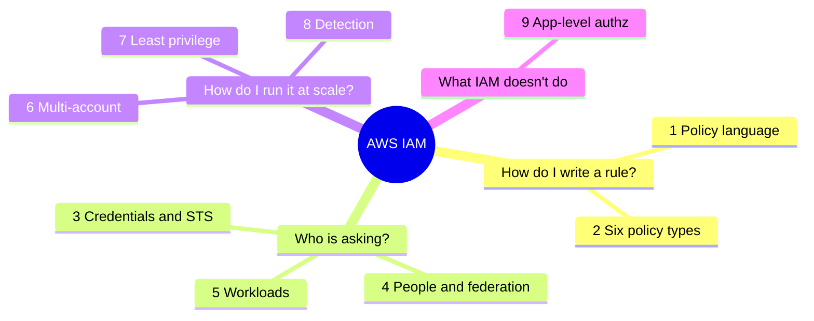

# AWS IAM cheatsheet (the topics the labs don't cover)

A quick-revision reference for the parts of IAM that labs 1 to 10 leave out. Every
term is explained and nothing is assumed. Read it once top to bottom, then come back
to look things up.

> Some features here are fairly new (RCPs, declarative policies, centralised root
> access, EKS Pod Identity, Verified Permissions) and AWS keeps changing them. Check
> the AWS docs for exact behaviour and limits before you rely on them.

---

## Mind map

The nine sections fall into four questions. The details for each branch are in the
matching section below.

---

## 1. Policy language

A policy is a JSON document that says who can do what, to which resources, and
under which conditions.

### Statement elements

| Element | What it means | Watch out for |
|---|---|---|
| `Effect` | `Allow` or `Deny` | It's the only required decision in a statement |
| `Action` | The operations, e.g. `s3:GetObject` | `NotAction` means every action except these. Powerful and easy to get wrong |
| `Resource` | What the actions apply to, as ARNs | `NotResource` means every resource except these |
| `Principal` | Who the statement applies to | Only used in resource-based and trust policies, never in identity policies. `NotPrincipal` (everyone except these) often causes accidental over-permission |
| `Condition` | Extra rules that must be true | e.g. only from this IP, only if MFA was used |
| `Sid` | An optional label | Just helps you find the statement later |

### Condition operators

Pick the wrong one and security breaks without any error.

| Kind | Operators |
|---|---|
| String | `StringEquals`, `StringNotEquals`, `StringLike` (allows `*`) |
| Number, date, yes/no | `NumericEquals`, `DateGreaterThan`, `Bool` |
| Network and ARN | `IpAddress`, `ArnLike` |
| Is the key there at all? | `Null` |
| `...IfExists` suffix | Only test the key if it's present; a missing key doesn't fail |
| `ForAnyValue` | For keys with several values: at least one value matches |
| `ForAllValues` | For keys with several values: every value matches. **It passes when the set is empty**, which attackers can abuse. Treat it as a known trap |

### Policy variables

These are filled in when the request happens, so one policy can serve many users.
They're what makes tag-based access (ABAC) work.

- `${aws:username}` becomes the caller's user name.
- `${aws:PrincipalTag/team}` becomes the caller's team tag.

### Global condition keys

Facts about the request that AWS hands you to test in conditions:

| Key | Tells you |
|---|---|
| `aws:SourceIp` | Where the request came from |
| `aws:MultiFactorAuthPresent` | Whether MFA was used |
| `aws:SecureTransport` | Whether it came over HTTPS |
| `aws:CurrentTime` | When it happened |
| `aws:PrincipalArn` | Who is calling |
| `aws:PrincipalOrgID` | Which AWS organisation the caller belongs to |

### ARNs

An ARN (Amazon Resource Name) is a resource's unique address:
`arn:aws:service:region:account-id:resource`

The `aws` part is the partition. GovCloud uses `aws-us-gov` and the China regions use
`aws-cn`. A policy written for one partition won't work in another, but that only
matters if you work in those special regions.

### Managed vs inline policies

| Managed | Inline |
|---|---|
| Standalone and reusable; attach it to many users or roles | Written inside one user or role; can't be reused |
| Keeps up to 5 old versions so you can roll back | No versions |

AWS also ships its own ready-made managed policies. They're often broader than you
need, so write your own scoped policies for anything sensitive.

---

## 2. The six policy types

AWS weighs all the relevant ones together, and an explicit `Deny` in any of them
always wins.

| Type | Attached to | What it does | In the labs? |
|---|---|---|---|
| Identity-based | A user, group or role | Says what that identity can do | Yes |
| Resource-based | A resource, e.g. an S3 bucket | Says who can use the resource | Yes |
| Permission boundary | An identity | Caps what identity policies can grant. Never grants anything by itself | Yes |
| SCP (Service Control Policy) | The org, an OU or an account | An org-wide guardrail on **identities**. It only takes permissions away, and it doesn't apply to the management account | Yes |
| RCP (Resource Control Policy) | The org, an OU or an account | The newer SCP counterpart for **resources**. You can set "only my org's principals may touch our S3 buckets" once, centrally, instead of in every bucket policy | As a concept in the data-perimeter lab |
| Session policy | Passed in when you assume a role | Narrows that one session further. Handy when a broker hands out temporary credentials that should be tighter than the role. You get the role's permissions minus whatever the session policy removes | No |

You'll also see **ACLs** (access control lists) on S3 buckets and objects. They're
legacy and mostly replaced by bucket policies, but you should recognise the word.

---

## 3. Credentials and sign-in

STS (Security Token Service) hands out temporary credentials. They expire on their
own, which is why they're safer than long-lived keys.

| STS action | When you'd use it |
|---|---|
| `AssumeRole` | Take on a role in your own account or another one (used in the labs) |
| `AssumeRoleWithSAML` | Take on a role after signing in through a SAML identity provider, the common corporate login standard |
| `AssumeRoleWithWebIdentity` | Take on a role after signing in through OIDC, e.g. GitHub or Google (the GitHub lab uses this) |
| `GetSessionToken` | Get short-lived credentials for your existing identity, often to add MFA to CLI use |
| `GetFederationToken` | An older way to give temporary credentials to a federated user |
| `GetCallerIdentity` | Tells you who you are right now. It can never be denied, so it's great for debugging |

**SourceIdentity** is an optional stamp on a role session that records the real
person behind it. The caller can't change it (unlike the session name), and it
carries over when one role assumes another. That makes audit trails trustworthy,
which is why interviewers like asking about it.

**MFA** adds a second proof of identity on top of a password. AWS supports app codes,
hardware tokens, and passkeys/FIDO2 keys, which resist phishing. To require MFA for
sensitive actions, test `aws:MultiFactorAuthPresent` in a condition.

**Credential hygiene** is the housekeeping:

- The credential report is a downloadable list of every user and the state of their
  keys and passwords.
- Rotate access keys regularly and delete the old ones.
- A password policy sets rules like minimum length.
- Overall, aim for as few long-lived credentials as possible and use temporary ones
  wherever you can.

---

## 4. People and federation

Federation means people sign in with an identity that lives outside IAM (like their
company login) and get temporary AWS access. Real organisations do this instead of
creating an IAM user for each person.

| Service | Who it's for | What to remember |
|---|---|---|
| IAM Identity Center | Staff, across many accounts | The recommended option. You build **permission sets** (bundles of permissions) and assign them to people or groups for specific accounts. It can connect to an outside directory and sync users in automatically. If you learn one thing from this section, make it this |
| SAML 2.0 | Corporate single sign-on | You set up your identity provider (Okta, Microsoft Entra ID) to trust AWS, and people sign in there |
| OIDC / web identity | Apps and CI systems | Same idea using the OIDC standard (the GitHub Actions lab is an example) |
| Amazon Cognito | The end users of your app, not your staff | Two parts people mix up: a **user pool** is the sign-up and sign-in directory; an **identity pool** gives those users temporary AWS credentials so the app can reach AWS for them |

---

## 5. Workloads (machines, not people)

Apps and machines need AWS permissions too. Give them a role, not hard-coded keys.

| Mechanism | What it is |
|---|---|
| EC2 instance role | A role on a virtual server, so code on it gets temporary credentials automatically (covered in a lab) |
| ECS task role | A role per container task, so each container only gets what it needs. A separate execution role lets the platform pull images and write logs |
| EKS: IRSA | IAM Roles for Service Accounts, the older way to give a Kubernetes pod its own role |
| EKS Pod Identity | The newer, simpler way. Both aim for a scoped role per pod rather than one big shared role |
| Lambda execution role | The role a function runs as. Other services, such as CloudFormation or CodeBuild, run with a service role you provide in the same way |
| IAM Roles Anywhere | Lets servers outside AWS (say, in your own data centre) get temporary credentials by proving who they are with a certificate, so you don't have to put long-lived keys on them |
| Forward access sessions (FAS) | When one AWS service has to call another to finish your request, it makes that call as you. The `aws:CalledVia` key lets you see and control this. Knowing about FAS explains a lot of "why did this succeed (or fail)?" puzzles |

---

## 6. Multi-account (AWS Organizations)

Most companies run many AWS accounts grouped under AWS Organizations.

| Feature | What it does |
|---|---|
| OUs (Organizational Units) | Folders of accounts, so you can apply rules to a whole group at once |
| Management account | Sits at the top. SCPs don't restrict it, so keep it nearly empty and tightly locked down |
| Delegated administration | Lets you run a security service from a dedicated account instead of the management account |
| Centralised root access management | Newer. Lets you remove or lock the root credentials in member accounts and manage them from one place, closing a long-standing risk |
| Declarative policies | Newer. Pins a service's configuration across the whole org (e.g. "EC2 public access is off everywhere") and keeps it enforced as accounts change |
| Tag, backup and AI-services opt-out policies | Org policies that sit near IAM but aren't about permissions. Tag policies keep labels consistent, which matters because ABAC only works if tags are reliable |
| AWS Control Tower | A managed service that sets up a well-structured multi-account environment (a "landing zone") and applies many of these guardrails for you |

---

## 7. Least privilege at scale

Least privilege means each identity gets only the permissions it actually needs.
Nobody can do that by hand across hundreds of roles, so AWS gives you tools.

| Tool | What it does |
|---|---|
| Access Analyzer: external and unused access | Finds resources shared outside your account or org, and permissions nobody uses (covered in a lab) |
| Access Analyzer: policy checks in CI/CD | Runs checks before a policy ships, like "does this grant new access?" or "does it avoid this dangerous action?", so over-permissive policies never go live |
| Access Advisor (service last accessed) | Shows which services and actions an identity has actually used, so you can safely remove the rest |
| Just-in-time access | People request elevated access only when they need it, and it expires afterwards. IAM Identity Center and various third-party tools support this |
| Policy as code | Checkov, cfn-guard and OPA/Conftest scan your infrastructure definitions for insecure IAM in the pipeline |
| CIS AWS Foundations Benchmark | A widely used checklist of baseline IAM controls (MFA on root, key rotation and so on) that auditors expect |

---

## 8. Detection

Knowing who did what matters as much as controlling it.

- **CloudTrail** records API calls in your account, including IAM and STS, and is
  your main audit trail. One catch: `PassRole` is a permission check, not an event of
  its own, so you spot it through the call that used the role rather than a
  `PassRole` log line.
- **GuardDuty** flags suspicious identity behaviour automatically, such as EC2
  instance credentials suddenly being used somewhere else, or odd role-assumption
  patterns.
- **Analysis tools** map out risk ahead of time. PMapper and Cloudsplaining find
  privilege-escalation paths and over-broad policies. Pacu is an offensive tool that
  plays the attacker so you can test your defences.

---

## 9. App-level authorization

IAM controls access to AWS itself (the control plane). It isn't built to answer
questions inside your own app, like "can this user view this document?"

- **Amazon Verified Permissions** handles that app-level authorization. You define
  the rules once and ask it for a yes or no whenever a user tries something in your
  app.
- **Cedar** is the policy language it uses. Knowing it exists mostly helps you see
  what IAM is for (cloud resources) and what it isn't for (the inside of your app).
- **KMS key policies**: every KMS encryption key has its own policy that works
  alongside IAM. Nearly every encrypt or decrypt checks both, so KMS is really an
  authorization system of its own.

---

## Commonly confused pairs

| This one | versus that one |
|---|---|
| **SCP** limits what *identities* can do across the org | **RCP** limits who can touch your *resources* across the org |
| **Permission boundary** caps one identity | **SCP** caps a whole account or OU |
| **IAM Identity Center** is for your staff getting into AWS | **Cognito** is for the end users of your app |
| **IRSA** is the older way to give a pod a role | **EKS Pod Identity** is the newer, simpler way |
| **IAM** authorizes access to AWS resources | **Verified Permissions** authorizes actions inside your app |
| A **role's policy** says what the role can do | A **resource policy** says who can use the resource |
