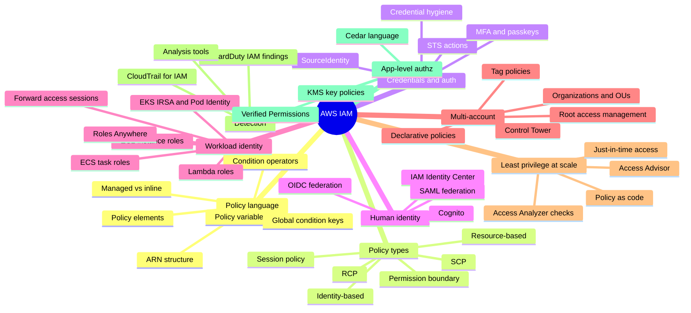

# AWS IAM Cheatsheet (the topics the labs don't cover)

This is a plain-English reference for the parts of IAM that the hands-on labs
(1–10) leave out. It is written for someone new to IAM: every term is explained,
and nothing is assumed. Read it top to bottom once for the big picture, then use
it to look things up.

> A few features here are fairly new (RCPs, declarative policies, centralised root
> access, EKS Pod Identity, Verified Permissions). AWS changes these over time, so
> confirm exact behaviour and limits in the official AWS docs before relying on them.

---

## Mind map

---

## 1. The policy language in more detail

An IAM policy is a JSON document that says who can do what, to which resources,
and under which conditions. Every statement inside a policy is built from a fixed
set of parts.

**The parts of a statement:**

- **Effect** is either `Allow` or `Deny`. This is the only required decision in a
  statement.
- **Action** lists the operations, such as `s3:GetObject`. `NotAction` means
  "everything except these actions", which is powerful and easy to get wrong.
- **Resource** lists what the actions apply to, written as ARNs (see below).
  `NotResource` means "everything except these resources".
- **Principal** says who the statement applies to. It is used in resource-based
  policies and trust policies, not in normal identity policies. `NotPrincipal`
  means "everyone except these principals" and is a common source of accidental
  over-permission, so use it carefully.
- **Condition** adds extra rules that must be true for the statement to apply, such
  as "only from this IP address" or "only if multi-factor authentication was used".
- **Sid** is just an optional label you give a statement so you can find it later.

**Condition operators** are the comparison used inside a condition. You need to
know these exist because the wrong one silently breaks security:

- String comparisons: `StringEquals`, `StringNotEquals`, `StringLike` (allows the
  `*` wildcard).
- Number, date, and yes/no comparisons: `NumericEquals`, `DateGreaterThan`, `Bool`.
- Network and ARN comparisons: `IpAddress`, `ArnLike`.
- The `Null` operator checks whether a key is present at all.
- Adding `IfExists` to an operator means "apply this test only if the key is
  present; if it is missing, don't fail on it".
- The set operators `ForAllValues` and `ForAnyValue` are used when a key can have
  several values at once. `ForAnyValue` means "at least one value matches".
  `ForAllValues` means "every value matches", and it quietly passes when the set is
  empty, which attackers can abuse. Treat these two as a known trap.

**Policy variables** are placeholders that get filled in at the moment of the
request, so one policy can serve many users. For example `${aws:username}` becomes
the caller's user name, and `${aws:PrincipalTag/team}` becomes the caller's team
tag. This is what makes tag-based access (ABAC) possible.

**Global condition keys** are facts about a request that AWS provides for you to
test in conditions. Useful ones to recognise: `aws:SourceIp` (where the request
came from), `aws:MultiFactorAuthPresent` (was MFA used), `aws:SecureTransport` (was
it over HTTPS), `aws:CurrentTime` (when), `aws:PrincipalArn` (who is calling), and
`aws:PrincipalOrgID` (which AWS organisation the caller belongs to).

**ARN structure.** An ARN (Amazon Resource Name) is the unique address of a
resource. It looks like
`arn:aws:service:region:account-id:resource`. The `aws` part is the "partition".
Most accounts are in the `aws` partition, but AWS GovCloud uses `aws-us-gov` and
the China regions use `aws-cn`. Policies written for one partition do not work in
another, which matters only if you ever work in those special regions.

**Managed versus inline policies.** A *managed* policy is a standalone, reusable
policy you can attach to many users or roles. An *inline* policy is written
directly inside a single user or role and cannot be reused. Managed policies keep
up to five old versions so you can roll back. AWS also provides its own ready-made
managed policies, but these are often broader than you need, so prefer writing your
own scoped policies for anything sensitive.

---

## 2. The six policy types as one picture

There are six mechanisms that grant or limit permissions. When a request is
evaluated, AWS considers all of the relevant ones together. An explicit `Deny` in
any of them always wins.

- **Identity-based policy:** attached to a user, group, or role. Says what that
  identity can do. (Covered in the labs.)
- **Resource-based policy:** attached to a resource, such as an S3 bucket. Says who
  may use that resource. (Covered in the labs.)
- **Permission boundary:** an upper limit on what an identity-based policy can
  grant. It never grants anything on its own; it only caps. (Covered in the labs.)
- **Service Control Policy (SCP):** an organisation-wide guardrail on identities. It
  can only take permissions away across accounts, never add them, and it does not
  apply to the organisation's management account. (Covered in the labs.)
- **Resource Control Policy (RCP):** the newer counterpart to an SCP, but for
  resources instead of identities. It lets you enforce a rule such as "only my
  organisation's principals may access any of our S3 buckets" from one central
  place, instead of repeating that rule in every bucket policy. (Introduced in a
  data-perimeter lab as a concept.)
- **Session policy:** a temporary policy passed in at the moment you assume a role,
  which further narrows that one session. This is the one type no lab covers. It is
  useful when a broker system hands out temporary credentials and wants each
  session to be more limited than the role itself. Think of it as "the role's
  permissions, minus whatever this session policy also removes".

There is also an older mechanism called an **ACL** (access control list) on S3
buckets and objects. It is legacy and mostly replaced by bucket policies, but you
should know the word.

---

## 3. Credentials and how sign-in actually works

**STS (Security Token Service)** is the AWS service that hands out temporary
credentials. Temporary credentials expire on their own, which is why they are safer
than long-lived keys. The main STS actions:

- `AssumeRole`: take on a role in your own or another AWS account. (Used in labs.)
- `AssumeRoleWithSAML`: take on a role after signing in through a SAML identity
  provider (a common corporate login standard).
- `AssumeRoleWithWebIdentity`: take on a role after signing in through an OIDC
  provider such as GitHub or Google. (The GitHub lab uses this.)
- `GetSessionToken`: get short-lived credentials for your existing identity, often
  to add multi-factor authentication to command-line use.
- `GetFederationToken`: an older way to hand out temporary credentials to a
  federated user.
- `GetCallerIdentity`: simply tells you who you currently are. It can never be
  denied, so it is handy for debugging.

**SourceIdentity** is an optional stamp you can put on a role session that records
who the real human behind it is. Unlike a session name, the caller cannot change
it, and it follows along even when one role assumes another role. This makes audit
trails trustworthy, which is why it comes up in security interviews.

**Multi-factor authentication (MFA)** adds a second proof of identity beyond a
password. AWS supports app-based codes, physical hardware tokens, and modern
passkeys/FIDO2 security keys (a phishing-resistant option). You can require MFA for
sensitive actions by testing `aws:MultiFactorAuthPresent` in a policy condition.

**Credential hygiene** is the housekeeping side. A *credential report* is a
downloadable list of every user and the state of their keys and passwords. Access
keys should be rotated (replaced) regularly and old ones deleted. A password policy
sets rules such as minimum length. The broad goal is to have few long-lived
credentials and to replace them with temporary ones wherever possible.

---

## 4. Human identity and federation

"Federation" means letting people sign in with an identity that lives outside IAM
(such as their company login) and then giving them temporary AWS access. This is
how real organisations handle people, instead of creating an IAM user per person.

- **IAM Identity Center** is the recommended service for giving humans access across
  many AWS accounts. Instead of users and policies per account, you define
  *permission sets* (bundles of permissions) and assign them to people or groups for
  specific accounts. It can connect to an external directory and pull in users
  automatically. If you learn one thing in this section, learn this, because it is
  how modern AWS access for staff actually works.
- **SAML 2.0 federation** is a widely used standard for corporate single sign-on.
  You configure your identity provider (such as Okta or Microsoft Entra ID) to
  trust AWS, and people sign in there to get AWS access.
- **OIDC / web identity federation** is the same idea using the OIDC standard,
  common for applications and CI systems. (The GitHub Actions lab is an example.)
- **Amazon Cognito** is aimed at the *end users of your app*, not your staff. It has
  two parts that are easy to confuse: a *user pool* is a sign-up and sign-in
  directory for your app's users, while an *identity pool* is the part that can hand
  those users temporary AWS credentials so the app can reach AWS services on their
  behalf.

---

## 5. Giving identity to workloads (not people)

Applications and machines also need AWS permissions, and the safe way is to give
them a role rather than hard-coded keys.

- **EC2 instance roles:** a role attached to a virtual server so code on it gets
  temporary credentials automatically. (Covered in a lab.)
- **ECS task roles:** a role for a container task, so each container gets only the
  permissions it needs. There is also a separate execution role that lets the
  container platform pull images and write logs.
- **EKS (Kubernetes) identity:** there are two ways to give a Kubernetes pod an AWS
  identity. The older one is called *IRSA* (IAM Roles for Service Accounts). The
  newer, simpler one is *EKS Pod Identity*. Both aim to give each pod its own scoped
  role instead of sharing one big one.
- **Lambda execution roles:** the role a serverless function runs as. Other AWS
  services (such as CloudFormation or CodeBuild) similarly run using a *service
  role* you provide.
- **IAM Roles Anywhere:** lets servers or workloads *outside* AWS (for example in
  your own data centre) get temporary AWS credentials by proving their identity with
  a certificate. This avoids putting long-lived AWS keys on machines that are not in
  AWS.
- **Forward access sessions (FAS):** when you call one AWS service and it needs to
  call another service to finish the job, it makes that follow-on call *as you*,
  carrying your identity. The condition key `aws:CalledVia` lets you see and control
  this. Knowing FAS exists explains many "why did this call succeed or fail"
  puzzles.

---

## 6. Many accounts at once (Organizations)

Most companies use many AWS accounts, grouped under **AWS Organizations**.

- **Organizational Units (OUs)** are folders that group accounts, so you can apply
  rules to a whole group. The **management account** sits at the top and is special:
  guardrail policies (SCPs) do not restrict it, so you keep it nearly empty and
  tightly controlled. **Delegated administration** lets you run a security service
  from a dedicated account rather than the management account.
- **Centralised root access management** is a newer feature that lets you remove or
  lock the all-powerful root credentials from member accounts and manage them from
  one place, which closes a long-standing risk.
- **Declarative policies** are a newer organisation policy type that lets you fix a
  service's configuration across the whole organisation (for example, "EC2 public
  access is turned off everywhere") in a way that stays enforced even as accounts
  change.
- **Tag policies, backup policies, and AI-services opt-out** are other
  organisation-level policies that live near IAM but are not about permissions. Tag
  policies keep resource labelling consistent, which matters because tag-based
  access depends on tags being reliable.
- **AWS Control Tower** is a managed service that sets up a well-structured
  multi-account environment (a "landing zone") for you, applying many of these
  guardrails automatically.

---

## 7. Getting to least privilege across a big estate

"Least privilege" means giving each identity only the permissions it actually
needs. Doing this by hand across hundreds of roles is impossible, so AWS provides
tooling.

- **Access Analyzer external and unused access:** finds resources shared outside
  your account or organisation, and permissions that are never used. (Covered in a
  lab.)
- **Access Analyzer policy checks in CI/CD:** automated checks you can run before a
  policy is deployed, such as "does this change grant new access" or "does this
  policy avoid a specific dangerous action". This catches over-permissive policies
  before they go live.
- **Access Advisor (service last accessed):** shows which services and actions an
  identity has actually used, so you can safely remove the rest.
- **Just-in-time access:** instead of standing permissions, a person requests
  elevated access only when they need it, and it expires afterwards. IAM Identity
  Center and various third-party tools support this pattern.
- **Policy as code:** tools such as Checkov, cfn-guard, and OPA/Conftest scan your
  infrastructure definitions for insecure IAM before deployment, so bad policies are
  caught in the pipeline.
- **Compliance benchmarks:** the CIS AWS Foundations Benchmark is a widely used
  checklist of baseline IAM controls (such as MFA on root and key rotation) that
  auditors expect.

---

## 8. Watching IAM (the detection side)

Knowing who did what is as important as controlling it.

- **CloudTrail** records the API calls made in your account, including IAM and STS
  actions, which is your primary audit trail. One subtlety: passing a role
  (`PassRole`) is a permission check rather than its own event, so you detect it
  through the call that used the role, not a `PassRole` log line.
- **GuardDuty** is a threat-detection service that flags suspicious identity
  behaviour automatically, such as credentials from an EC2 instance suddenly being
  used somewhere else, or unusual role-assumption patterns.
- **Analysis tools** map out risk in advance. *PMapper* and *Cloudsplaining* find
  privilege-escalation paths and over-broad policies. *Pacu* is an offensive testing
  tool that simulates what an attacker could do, useful for checking your defences.

---

## 9. A different kind of authorization (app-level)

IAM controls access to AWS itself (the "control plane"). It is not designed to
answer questions inside your own application, such as "can this specific user view
this specific document". That is a related but separate problem.

- **Amazon Verified Permissions** is an AWS service for that application-level
  authorization. You define the rules once and ask it for a yes/no decision when a
  user tries to do something in your app.
- **Cedar** is the policy language Verified Permissions uses. Learning that it
  exists is mainly useful because it sharpens your understanding of what IAM is for
  (cloud resources) versus what it is not for (inside your app).
- **KMS key policies:** KMS is the encryption-key service, and each key has its own
  policy that works alongside IAM. Because almost every encryption or decryption
  decision checks both IAM and the key policy, KMS is worth understanding as an
  authorization system in its own right.

---

## Quick "which is which" reminders

These pairs are the ones beginners most often mix up:

- **SCP vs RCP:** an SCP limits what *identities* can do across the organisation; an
  RCP limits who can touch your *resources* across the organisation.
- **Permission boundary vs SCP:** a boundary caps one identity; an SCP caps a whole
  account or OU.
- **IAM Identity Center vs Cognito:** Identity Center is for your *staff* accessing
  AWS; Cognito is for the *end users of your application*.
- **IRSA vs EKS Pod Identity:** two ways to give a Kubernetes pod an AWS role; Pod
  Identity is the newer, simpler one.
- **IAM vs Verified Permissions:** IAM authorizes access to AWS resources; Verified
  Permissions authorizes actions inside your own application.
- **Role vs resource policy:** a role's policy says what the role can do; a
  resource's policy says who can use the resource.
