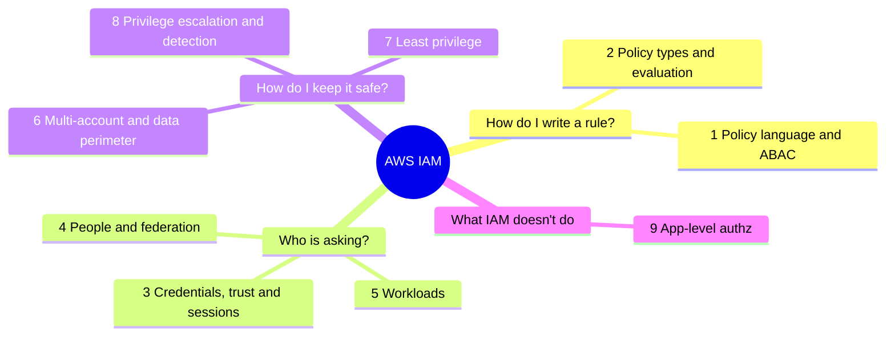

# AWS IAM cheatsheet

A quick-revision reference for all of IAM: the ten hands-on labs and the topics they
don't cover. Every term is explained and nothing is assumed. Read it once top to
bottom, then come back to look things up. Where a topic has a lab, the lab link takes
you to the full walkthrough.

> Some features here are fairly new (RCPs, declarative policies, centralised root
> access, EKS Pod Identity, Verified Permissions) and AWS keeps changing them. Check
> the AWS docs for exact behaviour and limits before you rely on them.

---

## Mind map

The nine sections fall into four questions. The details for each branch are in the
matching section below.

---

## 1. Policy language and ABAC

A policy is a JSON document that says who can do what, to which resources, and
under which conditions.

### Statement elements

| Element | What it means | Watch out for |
|---|---|---|
| `Effect` | `Allow` or `Deny` | It's the only required decision in a statement |
| `Action` | The operations, e.g. `s3:GetObject` | `NotAction` means every action except these. Powerful and easy to get wrong |
| `Resource` | What the actions apply to, as ARNs | `NotResource` means every resource except these |
| `Principal` | Who the statement applies to | Only used in resource-based and trust policies, never in identity policies. `NotPrincipal` (everyone except these) often causes accidental over-permission |
| `Condition` | Extra rules that must be true | e.g. only from this IP, only if MFA was used |
| `Sid` | An optional label | Just helps you find the statement later |

### Condition operators

Pick the wrong one and security breaks without any error.

| Kind | Operators |
|---|---|
| String | `StringEquals`, `StringNotEquals`, `StringLike` (allows `*`) |
| Number, date, yes/no | `NumericEquals`, `DateGreaterThan`, `DateLessThan`, `Bool` |
| Network and ARN | `IpAddress`, `ArnLike` |
| Is the key there at all? | `Null` |
| `...IfExists` suffix | Only test the key if it's present; a missing key doesn't fail |
| `ForAnyValue` | For keys with several values: at least one value matches |
| `ForAllValues` | For keys with several values: every value matches. **It passes when the set is empty**, which attackers can abuse. Treat it as a known trap |

### Policy variables

These are filled in when the request happens, so one policy can serve many users.
They're what makes tag-based access (ABAC) work.

- `${aws:username}` becomes the caller's user name.
- `${aws:PrincipalTag/team}` becomes the caller's team tag.

### Condition keys worth knowing

General request facts:

| Key | Tells you |
|---|---|
| `aws:SourceIp` | Where the request came from |
| `aws:MultiFactorAuthPresent` | Whether MFA was used |
| `aws:SecureTransport` | Whether it came over HTTPS |
| `aws:CurrentTime` | When it happened |
| `aws:PrincipalArn` | Who is calling |
| `aws:RequestedRegion` | Which region the call targets. Global services always report `us-east-1` (see section 6) |
| `aws:TokenIssueTime` | When the caller's temporary credentials were issued. The key to revoking sessions (see section 3) |
| `aws:CalledVia` | Which service made a call on your behalf (see section 5) |

Tags (ABAC):

| Key | Tells you |
|---|---|
| `aws:PrincipalTag/<key>` | A tag on the caller |
| `aws:ResourceTag/<key>` | A tag on the resource being touched |
| `aws:RequestTag/<key>` | A tag being set in this request |

Organisation and network (the data perimeter, see section 6):

| Key | Tells you |
|---|---|
| `aws:PrincipalOrgID` | Which AWS organisation the caller belongs to |
| `aws:PrincipalAccount` | Which account the caller belongs to (use it if you have no org) |
| `aws:ResourceOrgID` | Which organisation the target resource belongs to |
| `aws:SourceVpc` / `aws:SourceVpce` | Which VPC or VPC endpoint the request came through |
| `aws:PrincipalIsAWSService` | Whether an AWS service is calling. Use it to exempt AWS services from deny-based perimeters |

Service-specific keys you'll meet in the labs: `sts:ExternalId` (section 3),
`iam:PassedToService` and `iam:PermissionsBoundary` (section 8), and
`token.actions.githubusercontent.com:sub` / `:aud` (section 4).

### ARNs

An ARN (Amazon Resource Name) is a resource's unique address:
`arn:aws:service:region:account-id:resource`

The `aws` part is the partition. GovCloud uses `aws-us-gov` and the China regions use
`aws-cn`. A policy written for one partition won't work in another, but that only
matters if you work in those special regions.

### Managed vs inline policies

| Managed | Inline |
|---|---|
| Standalone and reusable; attach it to many users or roles | Written inside one user or role; can't be reused |
| Keeps up to 5 old versions so you can roll back | No versions |

AWS also ships its own ready-made managed policies. They're often broader than you
need, so write your own scoped policies for anything sensitive.

### ABAC and tag tampering ([Lab 6](lab-06-abac-tag-tampering.md))

ABAC (attribute-based access control) grants access when a resource tag matches a
principal tag, e.g. `aws:ResourceTag/team` equals `${aws:PrincipalTag/team}`. One
policy then covers every team.

The catch: **whoever controls the tags controls the access.** A broad tagging
permission is really a permission-granting permission, because retagging a resource
to your team gives you access to it.

The fix has two halves, and you need both:

- **Resource side:** deny writes to the `team` tag key, so nobody can retag a
  resource into their team.
- **Principal side:** lock down `sts:TagSession` and `iam:TagRole`, so an attacker
  can't change their *own* tag.

Two extras worth mentioning: tag-on-create (`aws:RequestTag` with `ec2:CreateAction`)
lets people tag a resource when they create it but never retag it afterwards, and a
CloudTrail alert on tag writes that touch the `team` key catches tampering.

---

## 2. Policy types and evaluation

### The six policy types

| Type | Attached to | What it does | Lab |
|---|---|---|---|
| Identity-based | A user, group or role | Says what that identity can do | [1](lab-01-identity-vs-resource-policies.md) |
| Resource-based | A resource, e.g. an S3 bucket | Says who can use the resource | [1](lab-01-identity-vs-resource-policies.md) |
| Permission boundary | An identity | Caps what identity policies can grant. Never grants anything by itself | [1](lab-01-identity-vs-resource-policies.md) |
| SCP (Service Control Policy) | The org, an OU or an account | An org-wide guardrail on **identities**. It only takes permissions away, and it doesn't apply to the management account | [5](lab-05-region-lockdown-scp.md) |
| RCP (Resource Control Policy) | The org, an OU or an account | The newer SCP counterpart for **resources**. You can set "only my org's principals may touch our S3 buckets" once, centrally, instead of in every bucket policy | [10](lab-10-data-perimeter.md) |
| Session policy | Passed in when you assume a role | Narrows that one session further. Handy when a broker hands out temporary credentials that should be tighter than the role. You get the role's permissions minus whatever the session policy removes | None |

You'll also see **ACLs** (access control lists) on S3 buckets and objects. They're
legacy and mostly replaced by bucket policies, but you should recognise the word.

### How AWS combines them ([Lab 1](lab-01-identity-vs-resource-policies.md))

- **An explicit `Deny` anywhere always wins.**
- **Same account:** it's a union. An allow in the identity policy *or* the resource
  policy is enough, as long as nothing denies. A bucket policy alone can grant a role
  access even when the role has no identity policy at all.
- **Cross-account:** it's an intersection. Both sides must allow: the resource
  policy (or trust policy) in one account, and the caller's identity policy in the
  other.
- **Boundaries and resource grants:** a permission boundary still limits a resource
  policy that grants access to a **role ARN**. It does *not* limit a grant made to a
  **session ARN** (`arn:aws:sts::...:assumed-role/Role/session`) or an IAM user ARN.
  That's a subtle way to get around a boundary.
- **Read the whole error.** AWS often names which policy type caused an
  `AccessDenied`.

---

## 3. Credentials, trust and sessions

### STS

STS (Security Token Service) hands out temporary credentials. They expire on their
own, which is why they're safer than long-lived keys.

| STS action | When you'd use it |
|---|---|
| `AssumeRole` | Take on a role in your own account or another one |
| `AssumeRoleWithSAML` | Take on a role after signing in through a SAML identity provider, the common corporate login standard |
| `AssumeRoleWithWebIdentity` | Take on a role after signing in through OIDC, e.g. GitHub or Google (see section 4) |
| `GetSessionToken` | Get short-lived credentials for your existing identity, often to add MFA to CLI use |
| `GetFederationToken` | An older way to give temporary credentials to a federated user |
| `GetCallerIdentity` | Tells you who you are right now. It can never be denied, so it's great for debugging |

The root user can't assume roles, so do your testing as an IAM or Identity Center
user.

### Trust policies and the confused deputy ([Lab 2](lab-02-trust-externalid-confused-deputy.md))

A role's trust policy says who may assume it.

- **Trusting `arn:aws:iam::<account>:root` trusts the whole account**, not just its
  root user. You're handing the decision to that account's admins: any principal
  there whose own identity policy allows it can assume the role.
- **Confused deputy:** a vendor service that assumes roles in many customer accounts
  can be tricked into assuming *your* role for an attacker, because role ARNs are
  easy to guess. It's a top risk for any multi-tenant vendor integration.
- **ExternalId is the standard fix.** It's a per-customer secret the vendor sends on
  every `AssumeRole` call, checked with `sts:ExternalId` in the trust policy. The
  vendor must generate it; if customers picked their own, an attacker could just
  pick yours.
- Also narrow the trusted principal to the vendor's specific role ARN, and give the
  role only the access it needs.
- **Failed assumes all look the same.** Missing permission, missing ExternalId and
  wrong ExternalId all return a generic `AccessDenied`. That's deliberate: a specific
  error would let an attacker confirm a real role and brute-force the ExternalId.
- **Deleting and recreating a role breaks trust that named it.** The new role gets a
  new internal unique ID, so an old trust policy no longer matches it. This stops
  role re-creation attacks.
- To investigate, look at `AssumeRole` events in CloudTrail event history (it works
  without a trail) and compare `userIdentity`, `requestParameters` and `errorCode`.

### Revoking active sessions ([Lab 4](lab-04-revoking-active-sessions.md))

This is the most counterintuitive part of IAM incident response.

- **There is no API to revoke a single STS token.** It stays valid until it expires.
- Instead, add an explicit deny on everything for credentials issued before a cutoff
  time, using `DateLessThan` on `aws:TokenIssueTime`. The console's "Revoke sessions"
  button does exactly this.
- It's fail-safe: legitimate users just sign in again and get a fresh session issued
  after the cutoff.
- Just removing the role's permissions isn't enough. The attacker has probably
  assumed other roles or made other credentials already, and stripping permissions
  breaks your own workloads.
- Full containment means, in the same window: revoke the sessions, delete any
  long-term keys the attacker created, and revoke any other roles they assumed.
  Otherwise they walk straight back in.
- Long-term access keys never expire, which is why attackers create them for
  persistence.

### SourceIdentity

An optional stamp on a role session that records the real person behind it. The
caller can't change it (unlike the session name), and it carries over when one role
assumes another. That makes audit trails trustworthy, which is why interviewers like
asking about it.

### MFA and credential hygiene

**MFA** adds a second proof of identity on top of a password. AWS supports app codes,
hardware tokens, and passkeys/FIDO2 keys, which resist phishing. To require MFA for
sensitive actions, test `aws:MultiFactorAuthPresent` in a condition.

**Credential hygiene** is the housekeeping:

- The credential report is a downloadable list of every user and the state of their
  keys and passwords.
- Rotate access keys regularly and delete the old ones.
- A password policy sets rules like minimum length.
- Overall, aim for as few long-lived credentials as possible and use temporary ones
  wherever you can.

---

## 4. People and federation

Federation means people sign in with an identity that lives outside IAM (like their
company login) and get temporary AWS access. Real organisations do this instead of
creating an IAM user for each person.

| Service | Who it's for | What to remember |
|---|---|---|
| IAM Identity Center | Staff, across many accounts | The recommended option. You build **permission sets** (bundles of permissions) and assign them to people or groups for specific accounts. It can connect to an outside directory and sync users in automatically. If you learn one thing from this section, make it this |
| SAML 2.0 | Corporate single sign-on | You set up your identity provider (Okta, Microsoft Entra ID) to trust AWS, and people sign in there |
| OIDC / web identity | Apps and CI systems | Same idea using the OIDC standard. GitHub Actions is the classic example (below) |
| Amazon Cognito | The end users of your app, not your staff | Two parts people mix up: a **user pool** is the sign-up and sign-in directory; an **identity pool** gives those users temporary AWS credentials so the app can reach AWS for them |

### GitHub Actions OIDC ([Lab 8](lab-08-github-oidc.md))

A workflow asks GitHub for an OIDC token describing itself (repo, branch,
environment). AWS trusts GitHub as an identity provider and swaps that token for a
role session via `AssumeRoleWithWebIdentity`. No AWS keys are stored in CI, which
removes the single biggest CI credential risk and is the fix you'd propose after a
leaked CI key. The same pattern works for GitLab, Terraform Cloud and any other
OIDC-capable CI.

The trust policy needs two conditions:

- `token.actions.githubusercontent.com:aud` equals `sts.amazonaws.com`. Keep it in
  `StringEquals`. Leaving it out weakens validation.
- `token.actions.githubusercontent.com:sub` pins the exact repo **and** the branch or
  environment. This is the real security boundary.

| `sub` pattern | Who can assume | Verdict |
|---|---|---|
| `repo:O/R:ref:refs/heads/main` | Only main | Good |
| `repo:O@*/R@*:ref:refs/heads/main` (`StringLike`) | Only main | Good, and needed when immutable IDs are on |
| `repo:O/R:environment:production` | Only that environment (add required reviewers) | Best for production |
| `repo:O/R:*` | Any branch, tag or fork pull request | Dangerous. The classic finding |
| `repo:O/*:*` or `repo:*` | Any repo in the org, or anywhere | Very dangerous |

Only use wildcards for the immutable-ID numbers, never to widen the repo or ref.
Trusting the wrong provider thumbprint used to be a risk too; AWS mostly handles that
now, but know the idea.

**Debugging "Not authorized to perform sts:AssumeRoleWithWebIdentity":** this one
error covers every claim mismatch and never says which.

1. Decode the real token in the workflow rather than guessing. Fetch it with `curl`
   from `$ACTIONS_ID_TOKEN_REQUEST_URL`, then `base64 -d | jq` the middle part. The
   workflow needs `permissions: id-token: write` for those variables to exist.
2. Compare `sub` and `aud` with your trust policy character by character. The usual
   culprits are a repo-name typo, the wrong branch (`master` vs `main`) and case,
   since matching is case-sensitive.
3. **Watch for immutable IDs.** Some orgs add numeric IDs to the subject, so it looks
   like `repo:my-user@12345678/my-repo@987654321:ref:refs/heads/main`. A
   `StringEquals` policy written for the plain format fails closed. The IDs are a
   security feature (they survive a rename, so nobody can recreate your repo name to
   inherit your trust). Fix it with `StringLike` and `@*` for the numbers only, or
   hard-code the exact `sub` with the IDs.
4. Check the OIDC provider's client-ID list includes `sts.amazonaws.com`, and set
   `audience: sts.amazonaws.com` on `configure-aws-credentials` if the token's `aud`
   differs.
5. Rule out timing (wait 30 seconds and push a fresh commit, don't re-run the old
   one) and org policy (in a member account an SCP or RCP could deny the call).

---

## 5. Workloads (machines, not people)

Apps and machines need AWS permissions too. Give them a role, not hard-coded keys.

| Mechanism | What it is |
|---|---|
| EC2 instance role | A role on a virtual server, so code on it gets temporary credentials automatically |
| ECS task role | A role per container task, so each container only gets what it needs. A separate execution role lets the platform pull images and write logs |
| EKS: IRSA | IAM Roles for Service Accounts, the older way to give a Kubernetes pod its own role |
| EKS Pod Identity | The newer, simpler way. Both aim for a scoped role per pod rather than one big shared role |
| Lambda execution role | The role a function runs as. Other services, such as CloudFormation or CodeBuild, run with a service role you provide in the same way |
| IAM Roles Anywhere | Lets servers outside AWS (say, in your own data centre) get temporary credentials by proving who they are with a certificate, so you don't have to put long-lived keys on them |
| Forward access sessions (FAS) | When one AWS service has to call another to finish your request, it makes that call as you. The `aws:CalledVia` key lets you see and control this. Knowing about FAS explains a lot of "why did this succeed (or fail)?" puzzles |

Handing a role to a service needs `iam:PassRole`, which is a classic escalation
path. See section 8.

---

## 6. Multi-account and data perimeter

### AWS Organizations

Most companies run many AWS accounts grouped under AWS Organizations.

| Feature | What it does |
|---|---|
| OUs (Organizational Units) | Folders of accounts, so you can apply rules to a whole group at once |
| Management account | Sits at the top. SCPs don't restrict it, so keep it nearly empty and tightly locked down |
| Delegated administration | Lets you run a security service from a dedicated account instead of the management account |
| Centralised root access management | Newer. Lets you remove or lock the root credentials in member accounts and manage them from one place, closing a long-standing risk |
| Declarative policies | Newer. Pins a service's configuration across the whole org (e.g. "EC2 public access is off everywhere") and keeps it enforced as accounts change |
| Tag, backup and AI-services opt-out policies | Org policies that sit near IAM but aren't about permissions. Tag policies keep labels consistent, which matters because ABAC only works if tags are reliable |
| AWS Control Tower | A managed service that sets up a well-structured multi-account environment (a "landing zone") and applies many of these guardrails for you |

### Region lockdown and the global-services trap ([Lab 5](lab-05-region-lockdown-scp.md))

A naive SCP that denies `Action: *` when `aws:RequestedRegion` isn't your region
breaks global services. IAM, Organizations, Route 53, CloudFront, the STS global
endpoint, Support, Billing (budgets), Cost Explorer and WAF are all served from
`us-east-1`, so their calls always report `us-east-1` wherever your workloads run.

- **The fix is swapping `Action: *` for `NotAction: [...]`** listing those global
  services, so the deny skips them.
- Real region-deny policies also exempt a break-glass role using `aws:PrincipalArn`.
  AWS publishes a maintained example policy worth starting from.
- An SCP hits every principal in an account or OU at once, so a bad one does a lot
  of damage. Roll out carefully: an empty test OU first, then one throwaway account,
  check both that the intended block works and that global services still work,
  then widen gradually.
- Remember SCPs never grant and never apply to the management account.

### Data perimeter ([Lab 10](lab-10-data-perimeter.md))

A data perimeter makes three promises. Interviewers love this grid, so learn it:

| | Trusted identities | Trusted resources | Expected networks |
|---|---|---|---|
| **Goal** | Only my org's principals | Only my org's resources | Only from my networks |
| **On identities (SCP)** | n/a | `aws:ResourceOrgID` | `aws:SourceVpc`, `aws:SourceIp` |
| **On resources (RCP or resource policy)** | `aws:PrincipalOrgID` | n/a | `aws:SourceVpce` |
| **On networks (VPC endpoint policy)** | `aws:PrincipalOrgID` | `aws:ResourceOrgID` | n/a |

- **Trusted identities** stops outsiders using a leaked credential on your resources,
  and cross-account confused deputies. Example: a bucket policy that denies `s3:*`
  unless `aws:PrincipalOrgID` matches your org. The explicit deny beats any allow the
  outsider has. (No org? Use `aws:PrincipalAccount`.)
- **Trusted resources** stops your principals sending data to an attacker's bucket.
  Example: an SCP with `aws:ResourceOrgID`, or an S3 VPC endpoint policy that only
  allows your org's buckets.
- **Expected networks** stops stolen credentials being used from elsewhere. Example:
  require requests to arrive through your endpoint with `aws:SourceVpce`. It's the
  stolen-session problem from section 3, solved at the network layer.
- Use `aws:PrincipalIsAWSService` to exempt AWS services from deny-based perimeters.
- **RCPs** let you enforce the trusted-identities rule centrally instead of in every
  resource policy. They cover a growing list of services (S3, STS, SQS, KMS, Secrets
  Manager and more), and mentioning them shows you're current.
- The perimeter is defence in depth: even if IAM is misconfigured or a credential
  leaks, out-of-org and out-of-network access is still blocked.

---

## 7. Least privilege at scale

Least privilege means each identity gets only the permissions it actually needs.
Nobody can do that by hand across hundreds of roles, so AWS gives you tools.

### IAM Access Analyzer ([Lab 7](lab-07-access-analyzer.md))

Access Analyzer uses automated reasoning (provable security) to work out who can
really reach your resources.

- **External access** finds resources reachable from outside your account or org:
  roles, S3, KMS, SQS, Secrets Manager, Lambda and more. If the sharing is a mistake,
  fix the policy and the finding becomes `RESOLVED`. If it's intended, archive it,
  and use **archive rules** so real issues don't get buried.
- **Unused access** flags unused roles, unused permissions inside a role, and unused
  users, access keys and passwords. It's charged per resource.
- **Policy generation** turns a role's CloudTrail history into a scoped draft policy.
- **Policy checks in CI/CD** run before a policy ships, like "does this grant new
  access?" or "does it avoid this dangerous action?", so over-permissive policies
  never go live.
- In an org, deploy one **organisation-wide analyzer** from a delegated-admin
  security account to cover every account.

### Other tools

| Tool | What it does |
|---|---|
| Access Advisor (service last accessed) | Shows which services and actions an identity has actually used, so you can safely remove the rest. Free, no analyzer needed |
| Just-in-time access | People request elevated access only when they need it, and it expires afterwards. IAM Identity Center and various third-party tools support this |
| Policy as code | Checkov, cfn-guard and OPA/Conftest scan your infrastructure definitions for insecure IAM in the pipeline |
| CIS AWS Foundations Benchmark | A widely used checklist of baseline IAM controls (MFA on root, key rotation and so on) that auditors expect |

A good least-privilege pipeline: unused-access findings plus last-accessed data to
spot dead permissions, policy generation from CloudTrail, review, then roll out.

---

## 8. Privilege escalation and detection

### The unifying rule

**Any permission that can change IAM is potentially admin.** Grant IAM-write actions
narrowly, scope them by resource, and ideally gate them with a permissions boundary
condition. Rhino Security Labs documented about 20 escalation methods; know four or
five by name along with the fix.

### PassRole ([Lab 3](lab-03-passrole-privilege-escalation.md))

`iam:PassRole` lets you hand a role to a service. With `PassRole` on `*`, your real
power becomes the most powerful role you can pass. In the lab, a developer with only
Lambda permissions and `PassRole` creates a function using an admin role, and the
function makes the developer admin.

- **Fix:** scope `PassRole` by resource (a specific role path, e.g.
  `role/lambda-apps/*`) **and** by `iam:PassedToService`.
- The same trick works with anything that accepts a role: EC2 (`RunInstances` plus
  an instance profile), ECS task roles, Glue, SageMaker, CloudFormation.
- A quieter attacker skips attaching a policy and just steals the role's temporary
  credentials from the Lambda environment. Same entry point, less noise.
- **Detection:** `PassRole` isn't logged as its own CloudTrail event; it's a
  permission check. Look for the call that used the role instead, such as
  `CreateFunction` or `UpdateFunctionConfiguration` where `requestParameters.role` is
  a privileged role.

### Other escalation paths ([Lab 9](lab-09-privesc-paths.md))

| Permission | How it's abused | Fix |
|---|---|---|
| `iam:CreatePolicyVersion` | Write a new admin version of a managed policy attached to you and set it as default | Never grant it on a policy that is (or could be) attached to the grantee |
| `iam:UpdateAssumeRolePolicy` | Rewrite a powerful role's trust policy so you can assume it | Treat it as highly privileged; never grant it on roles more powerful than the grantee. Protect admin roles' trust policies with an SCP |
| `iam:AttachRolePolicy` / `AttachUserPolicy` | Attach `AdministratorAccess` to yourself. The simplest path | Require a boundary with the `iam:PermissionsBoundary` condition key, or don't grant it |
| `iam:PutRolePolicy` | Write an admin inline policy onto yourself | Same idea: scope by resource or don't grant it |
| `iam:CreateLoginProfile` / `UpdateLoginProfile` | Set a console password for another user and sign in as them | Don't grant it on other users |
| `iam:CreateAccessKey` on another user | Mint keys for a more powerful user | Don't grant it on other users |

### Detection tools

- **CloudTrail** records API calls in your account, including IAM and STS, and is
  your main audit trail. Alert on the IAM-write calls above, on `AssumeRole`
  failures, and on tag writes to keys that drive ABAC.
- **GuardDuty** flags suspicious identity behaviour automatically, such as EC2
  instance credentials suddenly being used somewhere else, or odd role-assumption
  patterns.
- **Analysis tools** map out risk ahead of time. PMapper and Cloudsplaining find
  privilege-escalation paths and over-broad policies. Pacu is an offensive tool that
  plays the attacker so you can test your defences.

---

## 9. App-level authorization

IAM controls access to AWS itself (the control plane). It isn't built to answer
questions inside your own app, like "can this user view this document?"

- **Amazon Verified Permissions** handles that app-level authorization. You define
  the rules once and ask it for a yes or no whenever a user tries something in your
  app.
- **Cedar** is the policy language it uses. Knowing it exists mostly helps you see
  what IAM is for (cloud resources) and what it isn't for (the inside of your app).
- **KMS key policies**: every KMS encryption key has its own policy that works
  alongside IAM. Nearly every encrypt or decrypt checks both, so KMS is really an
  authorization system of its own.

---

## Commonly confused pairs

| This one | versus that one |
|---|---|
| **SCP** limits what *identities* can do across the org | **RCP** limits who can touch your *resources* across the org |
| **Permission boundary** caps one identity | **SCP** caps a whole account or OU |
| **Same account**: identity *or* resource policy allow is enough (union) | **Cross-account**: both sides must allow (intersection) |
| **Resource grant to a role ARN** is still capped by the role's boundary | **Resource grant to a session ARN** isn't |
| **Trusting `:root`** trusts the whole account | **Trusting a role ARN** trusts just that role |
| **Removing a role's permissions** stops one action and breaks your workloads | **Denying by `aws:TokenIssueTime`** kills old sessions and lets users sign in fresh |
| **`aws:PrincipalOrgID`** checks who's calling | **`aws:ResourceOrgID`** checks what's being touched |
| **IAM Identity Center** is for your staff getting into AWS | **Cognito** is for the end users of your app |
| **IRSA** is the older way to give a pod a role | **EKS Pod Identity** is the newer, simpler way |
| **IAM** authorizes access to AWS resources | **Verified Permissions** authorizes actions inside your app |
| A **role's policy** says what the role can do | A **resource policy** says who can use the resource |
